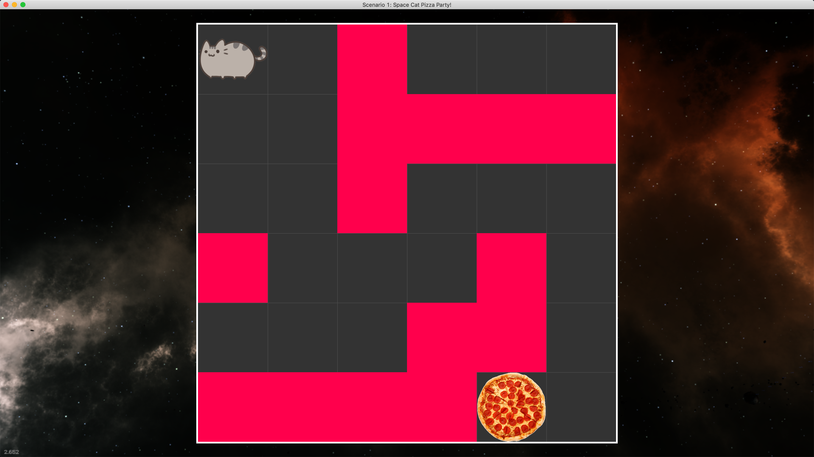

>Learn to code via interactive games!

### Table of Contents
* [Setup](#Setup)
* [Screenshots](#Screenshots)
* [Highlights](#Highlights)
* [Codebase](#Codebase)

## Setup
See the [setup](docs/environment_setup/index.md) section of [the docs](docs/index.md).

## Screenshots
### Scenario 1

### Scenario 2

## Highlights
* No prior programming experience required.
* Learn to use a professional development toolchain.
* Almost everything is written in Python,
    so you can explore 'how does this work?' as much as you want.
* Learn the fundamentals of a breadth of computer science topics:
    * Object Oriented Programming (OOP)
    * 2D Game Development (Modern OpenGL 3.2+)
    * Multi-player Game Development: Client/Server (http & tcp)
    * TODO
        * Audio Synthesis
        * Data Structures
        * Databases
        * AI
        * Machine Learning
        * Security / Cryptography 
        * Various 3D Graphics topics:
            * Quaternions and matrix math
            * Ray-tracing
            * Bounding Boxes and Object collision
  

## Codebase 
The following describes this codebase's directory structure as it concerns a student (you):
* **ccircle**: The base directory.
  * **cc**: The code for the cc python module. You shouldn't modify anything in this directory.
    * **install**: Install scripts.
  * **cc_student**: Contains all exercises (labs/scenarios/projects) you will work on.
    * **assets**: Things like fonts and images we will use for various labs/projects.
    * **docs**: Documents (PDFs, markdown notes) to be read for various labs/projects.
    * **hello_world**: Hello-world-type python files (that demonstrate functionality or validate system setup).
    * **scenarioXX**: All code for a scenario XX. The only file you will write code in is solution.py.
      * **skeleton**: Skeleton code given by the professor.
      * **README.md**: A document detailing the scenario.
      * **scenarioXX.py**: The python file to run to test out your code / display the window.
      * **solution.py**: A file with an incomplete function for you to complete.
    * **incomplete**: Incomplete exercises.
  * **screenshots**: Screenshots used for the webpage.

## TODO
- [x] Full OSX support for existing cc functionality.
    - [x] replace windows-native windowing with GLFW (OS-agnostic windowing)
    - [x] opengl++ (Mac requires OpenGL 3.2+) -> rewrite primitives rendering
        - [ ] XXX: [2-VAO paradigm](https://stackoverflow.com/a/8923298)--static and dynamic.
        - [ ] XXX: textured circles.
- [ ] Unit Tests (against stored image).
- [ ] Ensure Windows Support upon OSX rewrite completion.
- [ ] Setup.
    - [ ] Template /generate endpoint instead of cloning repo.
    - [ ] Use GitBooks?.
    - [ ] Pretend to be new, make youtube video of setup: 'Intro to Software Development'.
    - [ ] Walk through it with someone, take notes for improvement.
    - [ ] Slack community.
- [ ] All topics covered under Highlights.
  - [ ] XXX: 
    - [ ] Adapt things from [intro to python pdf](https://python.swaroopch.com/problem_solving.html)
    - [ ] Scenario or walkthrough like 
        [Writing a Program that Edits my Videos](https://www.youtube.com/watch?v=0ZeO0IQaJ-A)
        - [ ] Slack community.
- [ ] XXX: *nix support.
