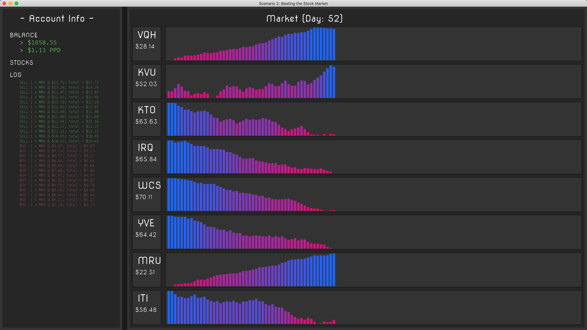

# [CCircle](index.md): Learn to code with Python!

## Highlights:
* No prior programming experience required.
* Through games, learn the fundamentals of a breadth of computer science topics:
  * Object Oriented Programming (OOP)
  * Data Structures
  * Audio Synthesis
  * AI
  * Machine Learning
  * Security / Cryptography 
  * Sandbox 2D Game Development
  * Multi-player Game Development: Client/Server (http & tcp)
  * Various 3D Graphics topics:
    * Quaternions and matrix math
    * Ray-tracing
    * Bounding Boxes and Object collision
* Learn to use a professional development toolchain.
* Everything is written from scratch in Python1, 
    so you can explore 'how does this work?' as much as you want.
  
1: As much as possible without re-inventing the wheel.

## Project Layout (Student Perspective):
The following describes this project's directory structure as it concerns a student (you):
* **cc**: The code for the cc python module. You shouldn't modify anything in this directory.
* **cc_student**: Contains all exercises (labs/scenarios/projects) you will work on.
  * **assets**: Things like fonts and images we will use for various labs/projects.
  * **docs**: Documents (PDFs, markdown notes) to be read for various labs/projects.
  * **hello_world**: Hello-world-type python files (that demonstrate functionality or validate system setup).
  * **scenarioXX**: All code for a scenario XX. The only file you will write code in is solution.py.
    * **skeleton**: Skeleton code given by the professor.
    * **README.md**: A document detailing the scenario. 
    * **scenarioXX.py**: The python file to run to test out your code / display the window.
    * **solution.py**: A file with an incomplete function for you to complete. 
  * **incomplete**: Incomplete exercises.
* **screenshots**: Screenshots used for the webpage.

## Screenshots:
### Scenario 1

### Scenario 2

## Bhu Checklist (Prioritized!):
- [x] Full OSX support for existing cc functionality.
    - [x] replace windows-native windowing with GLFW (OS-agnostic windowing)
    - [x] opengl++ (Mac requires OpenGL 3.2+) -> rewrite primitives rendering
        - [ ] XXX: [2-VAO paradigm](https://stackoverflow.com/a/8923298)--static and dynamic.
        - [ ] XXX: textured circles.
- [ ] Ensure Windows Support upon OSX rewrite completion.
- [ ] Setup.
    - [ ] Get Github Pages site up.
    - [ ] Organize current setup (in docs/setup); improve experience.
    - [ ] Pretend to be new, make youtube video of setup: 'Intro to Software Development'.
    - [ ] Walk through it with someone, take notes for improvement.
- [ ] All topics covered under Highlights.
- [ ] XXX: *nix support.
