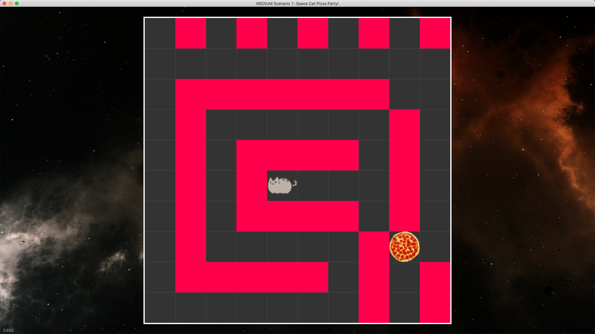
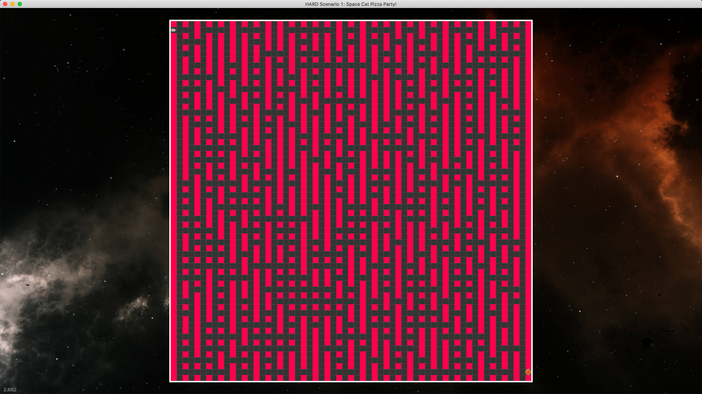

# [CCircle](index.md): Learn to code with Python!

## Highlights:
* No prior programming experience required.
* Through games, learn the fundamentals of a breadth of computer science topics:
  * Object Oriented Programming (OOP)
  * Data Structures
  * Audio Synthesis
  * AI
  * Machine Learning
  * Security / Cryptography 
  * Sandbox 2D Game Development
  * Multi-player Game Development: Client/Server (http & tcp)
  * Various 3D Graphics topics:
    * Quaternions and matrix math
    * Ray-tracing
    * Bounding Boxes and Object collision
* Learn to use a professional development toolchain.
* Everything is written from scratch in Python1, 
    so you can explore 'how does this work?' as much as you want.
  
1: As much as possible without re-inventing the wheel.

## Screenshots:
### Scenario01 
Easy 
Medium 
Hard 

## Bhu Checklist (Prioritized!):
- [ ] Windows, OSX, Linux support; cc module <- ccircle functionality.
    - [ ] Full OSX support for existing cc functionality.
        - [x] replace windows-native windowing with GLFW (OS-agnostic windowing)
        - [ ] opengl++ (Mac requires OpenGL 3.2+) -> rewrite primitives rendering
            - [ ] Get Scenario02 working with cc. 
            - [ ] Textured circles.
            - [ ] Split window.py into separate classes, leaving only public methods.
            - [ ] FPS
                - [ ] Fonts
            - [ ] XXX: [2-VAO paradigm](https://stackoverflow.com/a/8923298)--static and dynamic.
    - [ ] Ensure Windows Support once upon OSX rewrite completion.
    - [ ] Ensure Linux Support upon OSX rewrite completion.
- [ ] Setup.
    - [ ] Get Github Pages site up.
    - [ ] Organize current setup (in docs/setup); improve experience.
    - [ ] Pretend to be new, make youtube video of setup: 'Intro to Software Development'.
    - [ ] Walk through it with someone, take notes for improvement.
- [ ] All topics covered under Highlights.
