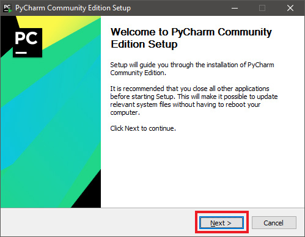
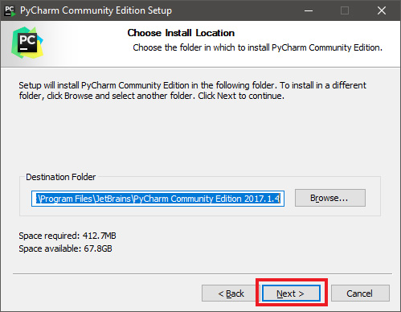
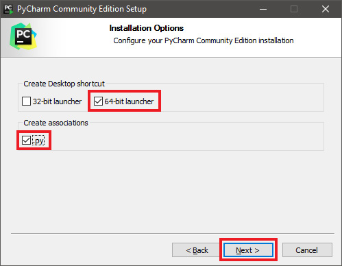
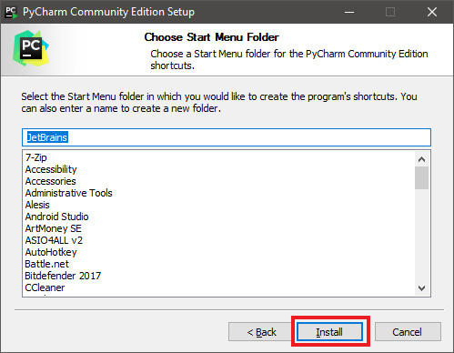
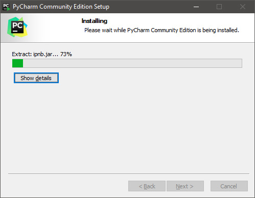
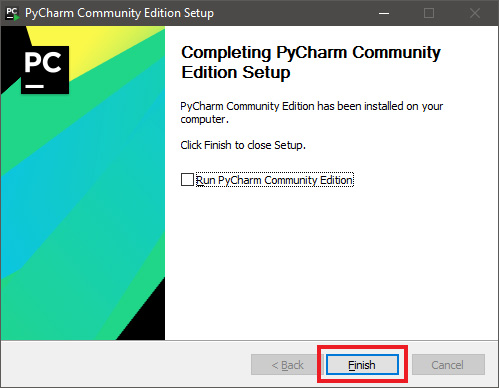

# CCircle.Setup.2 : Installing PyCharm
### Prev -> [CCircle.Setup.1](setup1.html)

* [Download PyCharm Community](https://www.jetbrains.com/pycharm/download/#section=windows).  
  Make sure to download the community edition and not the professional edition!
  Once downloaded, run the installer.

* Click next...  
  

* Click next again, the default path is fine...  
  

* Select the checkboxes for '64-bit launcher' and '.py', as shown below  
  

* Click install, the default folder name is fine  
  

* Wait...  
  

* Click finish! Don't run PyCharm yet, as we've still got some more setup to do
  before we open it.  
  

### Next -> [CCircle.Setup.3](setup3.html)
