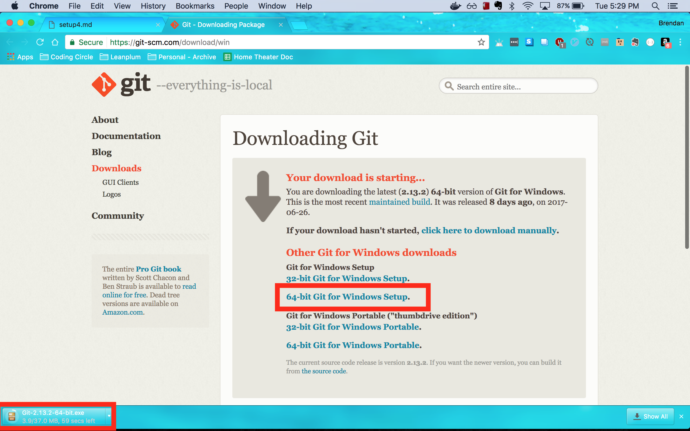

# CCircle.Setup.4 : Downloading Git
> ##### Previous -> [CCircle.Docs.Index](../../../index.md)

* First, [download 64-bit Git for Windows](https://git-scm.com/download/win)
  Run the download when it finishes.
  

* On the next pages, leave all settings as is; just click "next" to move on until the installer finishes.
