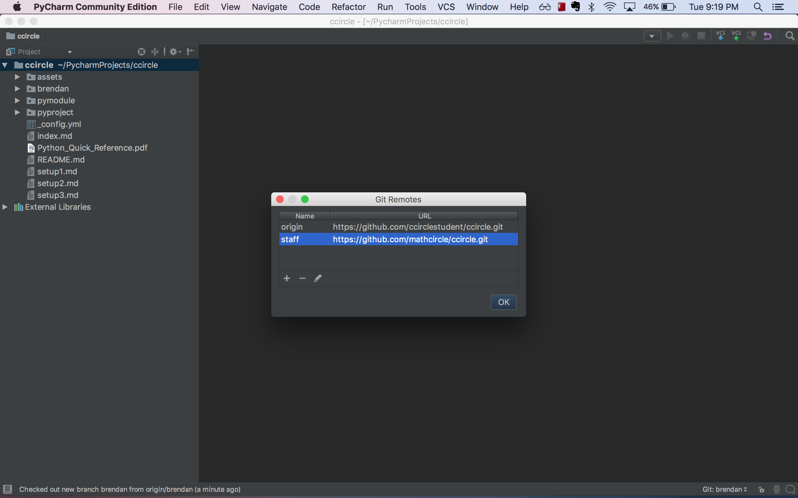
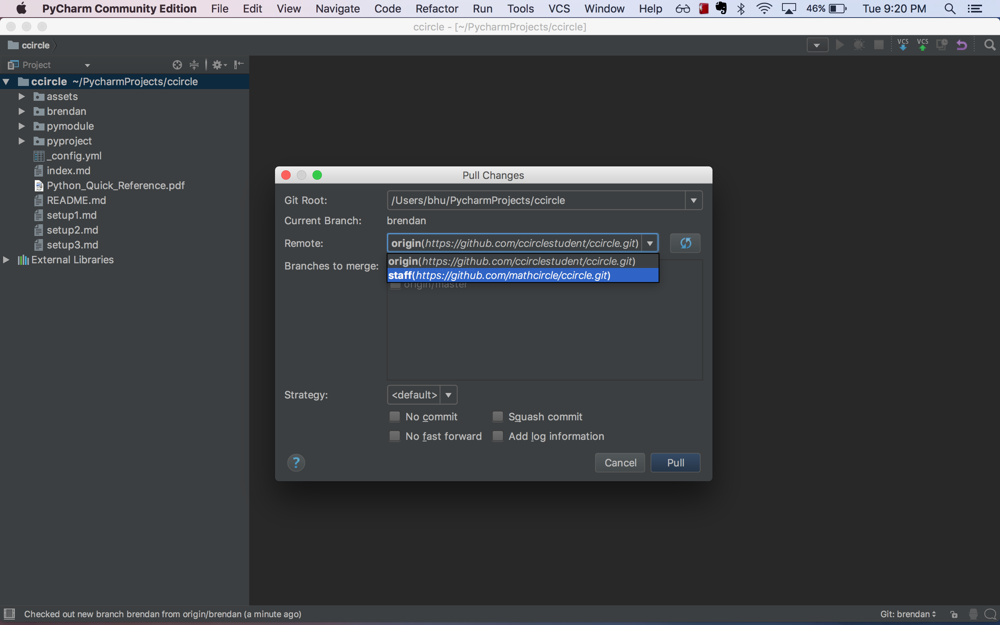
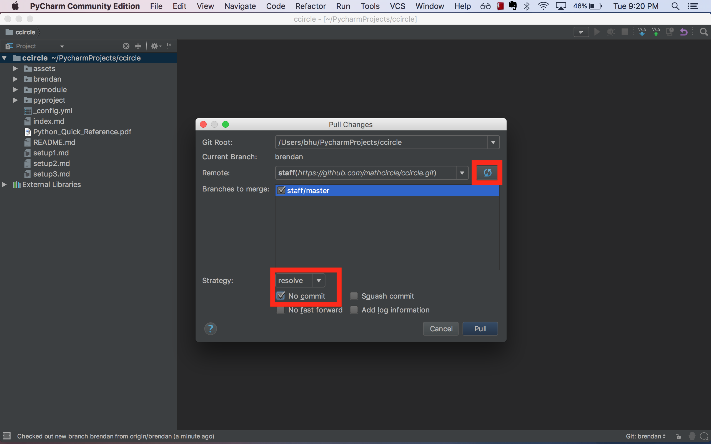
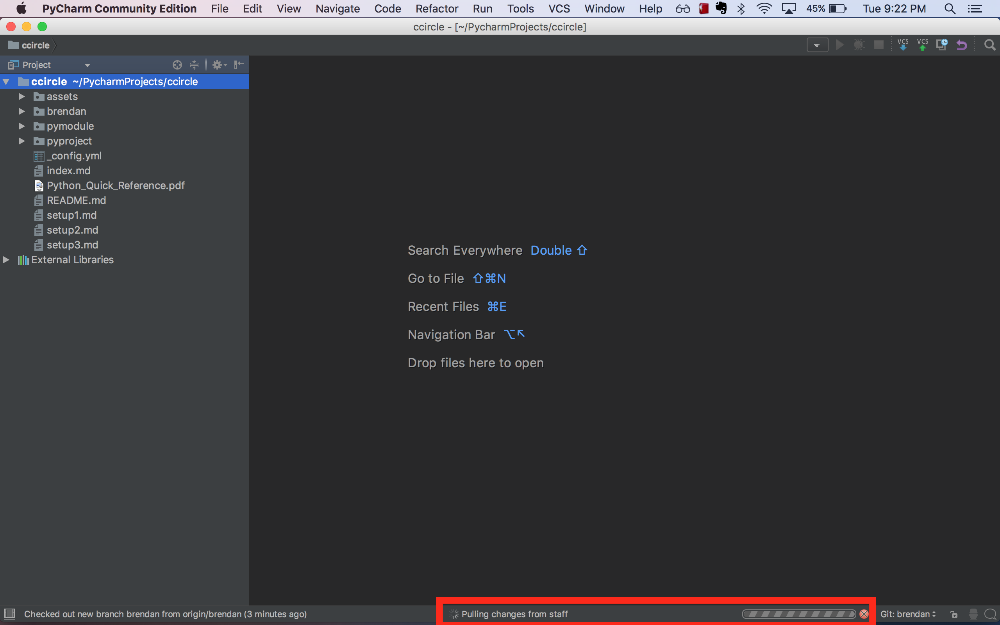

# CCircle.Update: Pulling Staff Changes to CCircle
> ##### Previous -> [CCircle.Docs.Index](../../../index.md)

* Spotlight search "remotes" and add an entry named "staff" that points to the URL "https://github.com/mathcircle/ccircle.git".
    

* Now, spotlight search "pull" and select "Staff" from the remote dropdown:
    

* Click the blue refresh icon.
    If it wasn't there before, a "origin/master" entry will appear under the "branches to merge" section.
    Make sure it is checked.
    Then, ensure the strategy is "resolve" and the "No commit" box is checked, then click "Pull".
    

* You should see a "pulling changes from staff" message at the bottom of your PyCharm. Wait for the pull to complete.
    

* Congratulations! You've pulled any staff changes to the ccircle repository!
