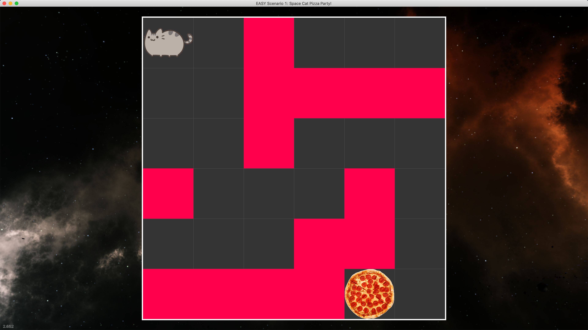

# CCircle.Setup.Mac : Installing the cc python module's dependencies.

* Navigate to ccircle -> cc -> setup -> mac -> install_dependencies.sh, right click and then select "Run". 
    
* Verify that the following output displays in PyCharm:
    

* If everything went smoothly, you can run one of the scenarios, for example `scenario01.py`:
    

##### Done -> [CCircle.Docs.Index](../../../index.md)
