# CCircle.Setup.Download : Downloading the ccircle Git Repository

* Open PyCharm, if you see a fullscreen that has a project open, then close the project.
    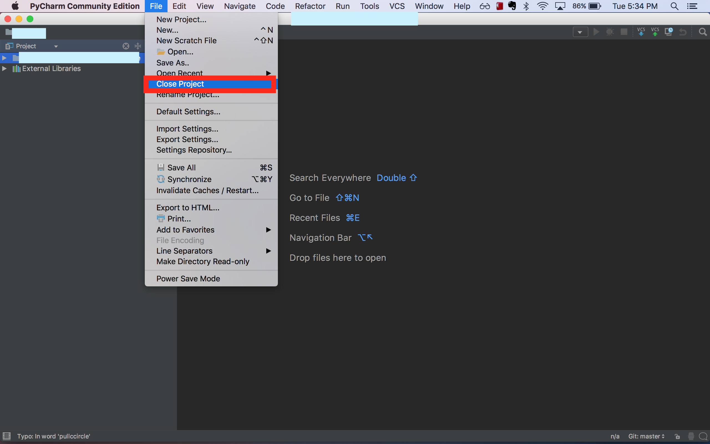
* You should have a prompt that looks like this:
    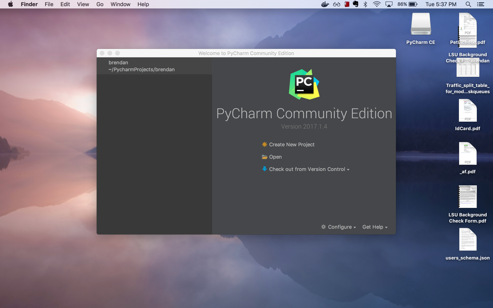
* Click the triangle dropdown to the right of the "Check out from Version Control" menu, and select "Git":
    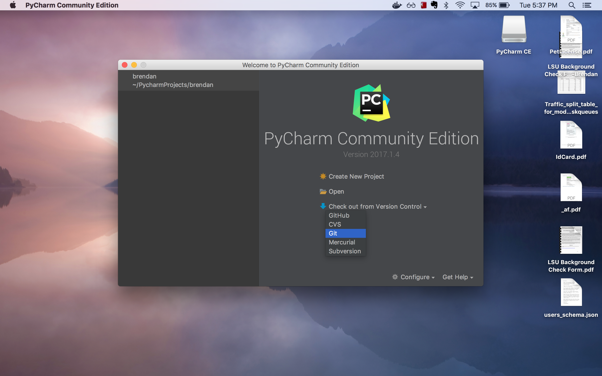
* Put https://github.com/mathcircle/ccircle.git for the "Git Repository URL:" and ensure the "Directory Name" is "ccircle". Then click the "Test" button:
    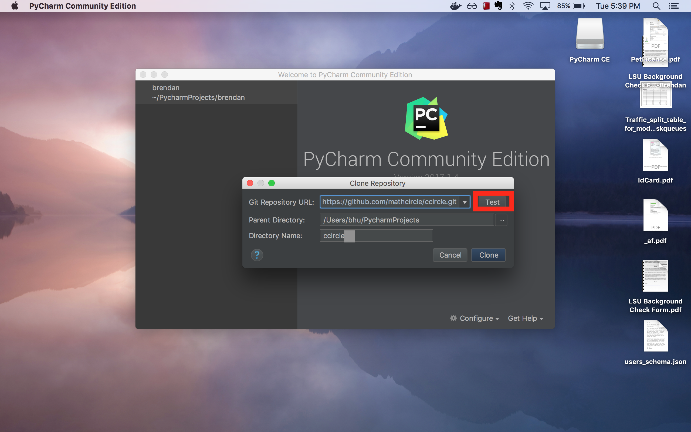
* A dialog should show that your connection was successful. Click "OK".
    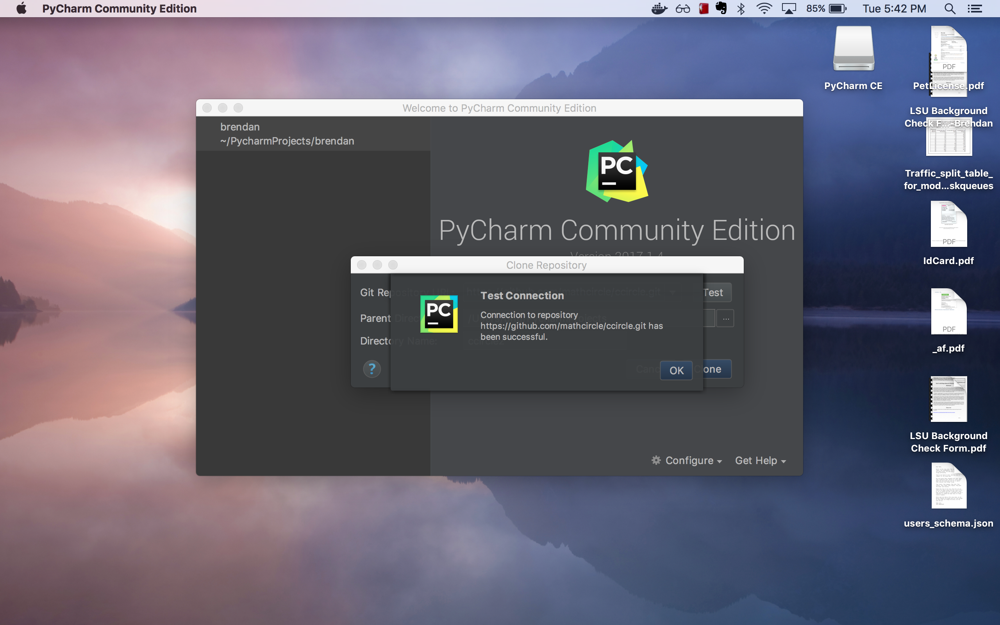
* Click "Clone":
    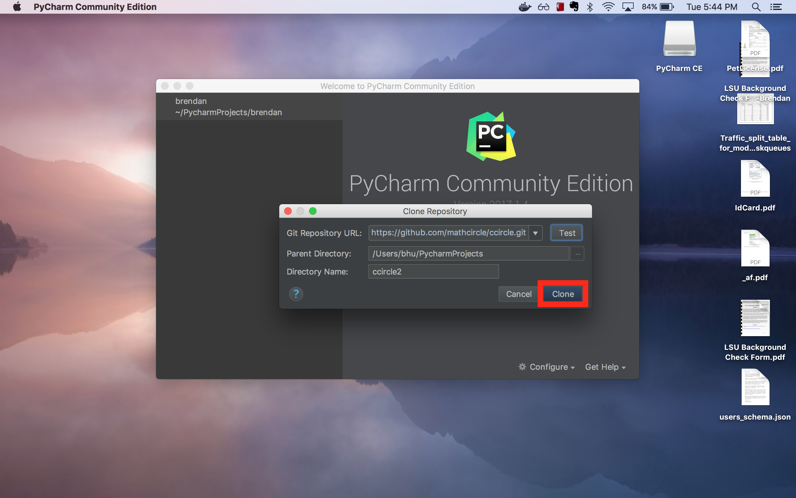
* Wait for the repository to finish downloading:
    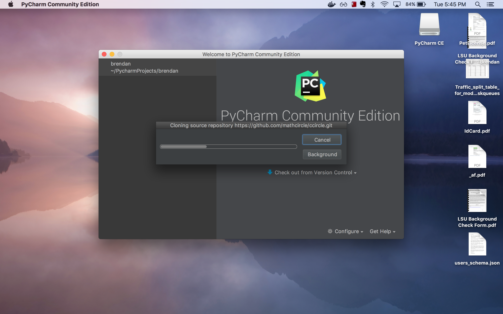
* Click "Yes" to open in PyCharm:
    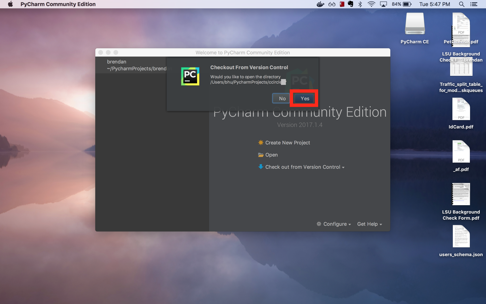
* Validate that the repository clone was successful by clicking the small triangle next to "ccircle" to list the directory's contents:
    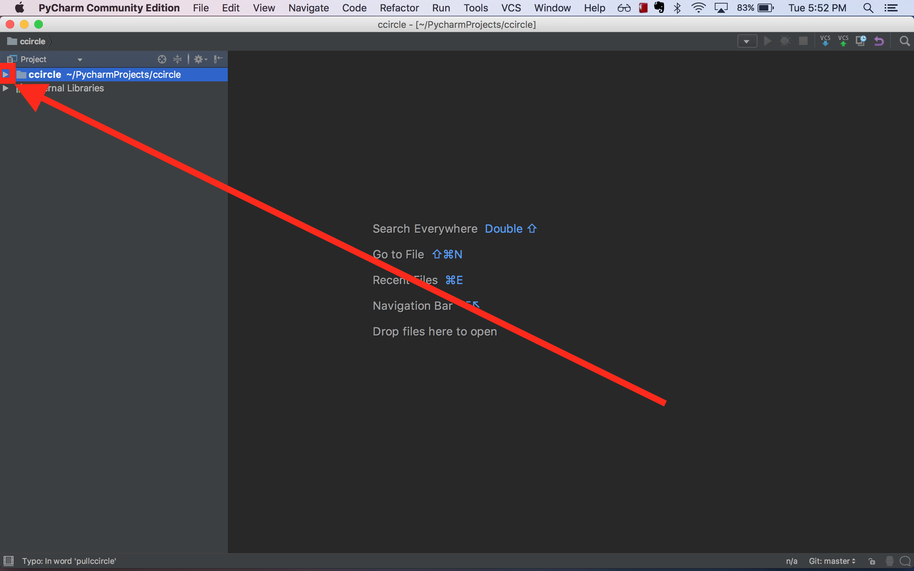
* Navigate to ccircle -> cc_student-> hello_world -> 01_hello.py, right click and then select "Run".
    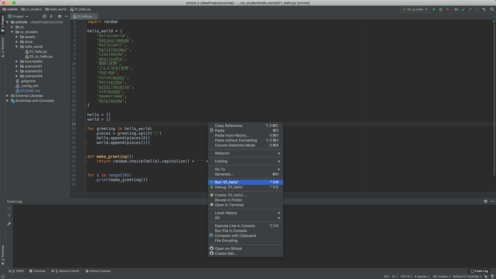
* Verify that the following output displays in PyCharm:
    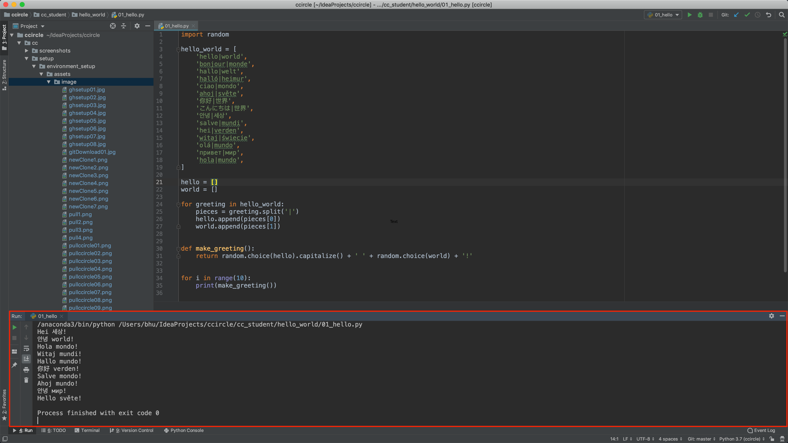
* Congratulations, you now have the ccircle repository on your computer!

### Next -> [CCircle.Setup.cc](../cc_deps/cc_deps.md)
