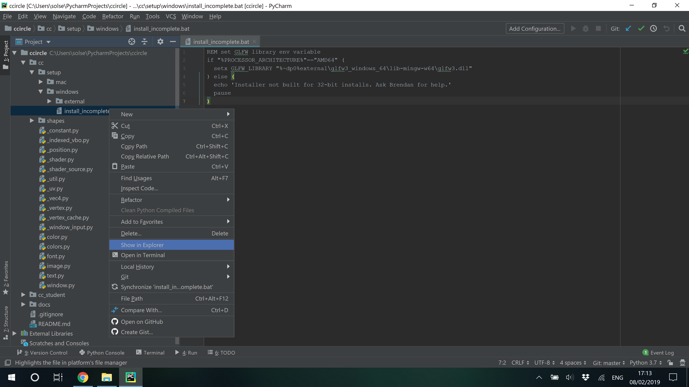
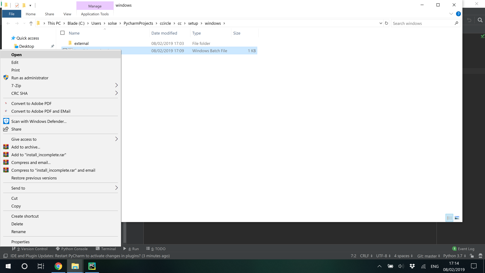
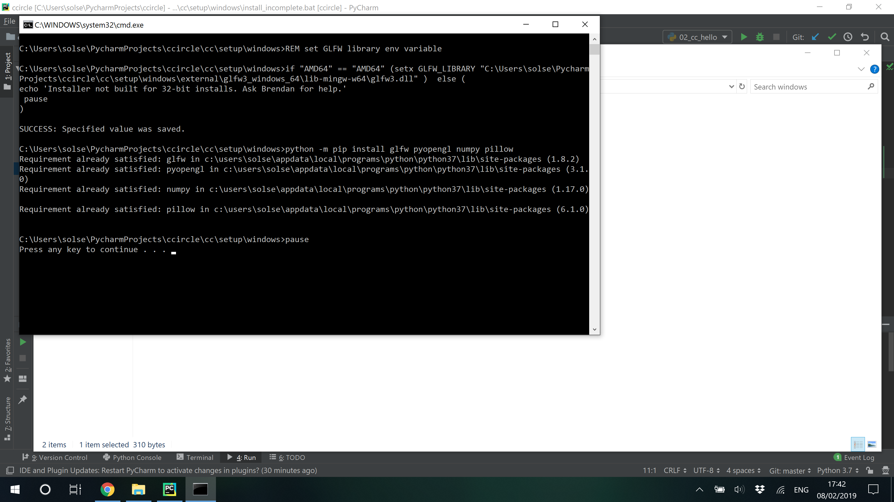

# CCircle.Setup.Windows : Installing the cc python module's dependencies.
### Main Setup -> [CCircle.Setup.Windows](../setup.md)

* Navigate to ccircle -> cc -> setup -> windows, and right click 'install_dependencies.bat':
  
  
* Either double click the batch file (`.bat`), or right click and select 'Open':
  

* Wait until the script is finished running. When finished, it will say 'Press any key to continue...':
  

Congratulations, you are done with setup! Try out some of the `hello_world` scripts to confirm your install: 
  > Navigate to ccircle -> cc_student -> hello_world -> 02_cc_hello.py, right click and then select "Run".
