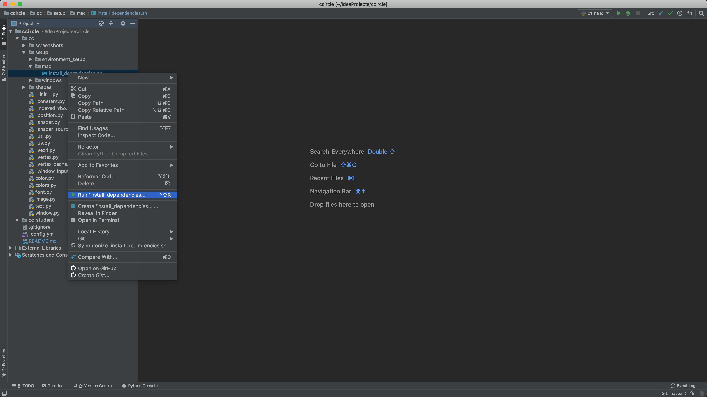
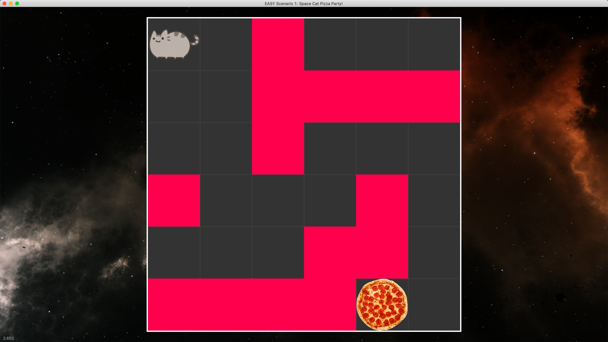

# CCircle.Setup.cc : Installing the cc python module's dependencies.

* [Mac](#Mac)
* [Windows](#Windows)

## Mac
* Navigate to ccircle -> cc -> setup -> mac -> install_dependencies.sh, right click and then select "Run". 
    
* Verify that the following output displays in PyCharm:
    

* If everything went smoothly, you can run one of the scenarios, for example `scenario01.py`:
    
    
## Windows
Sorry, the windows installer isn't built yet!

Since you're here, feel free to send me an email and I will prioritize it.

**Congratulations you've completed the setup! Your computer is now ready to run everything!**

##### Done -> [CCircle.Docs.Index](../../index.md)
