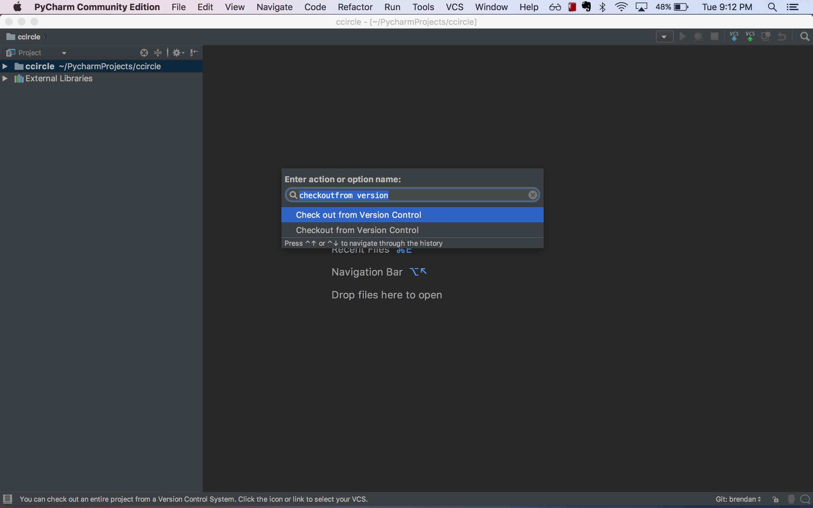
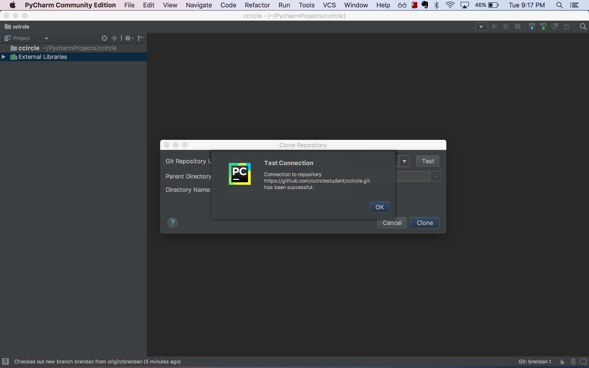
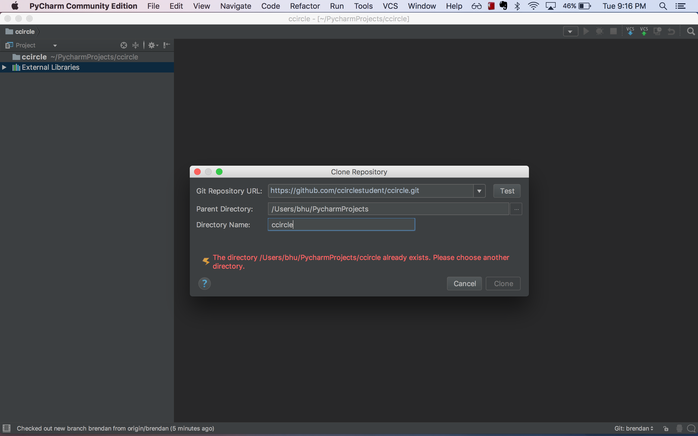
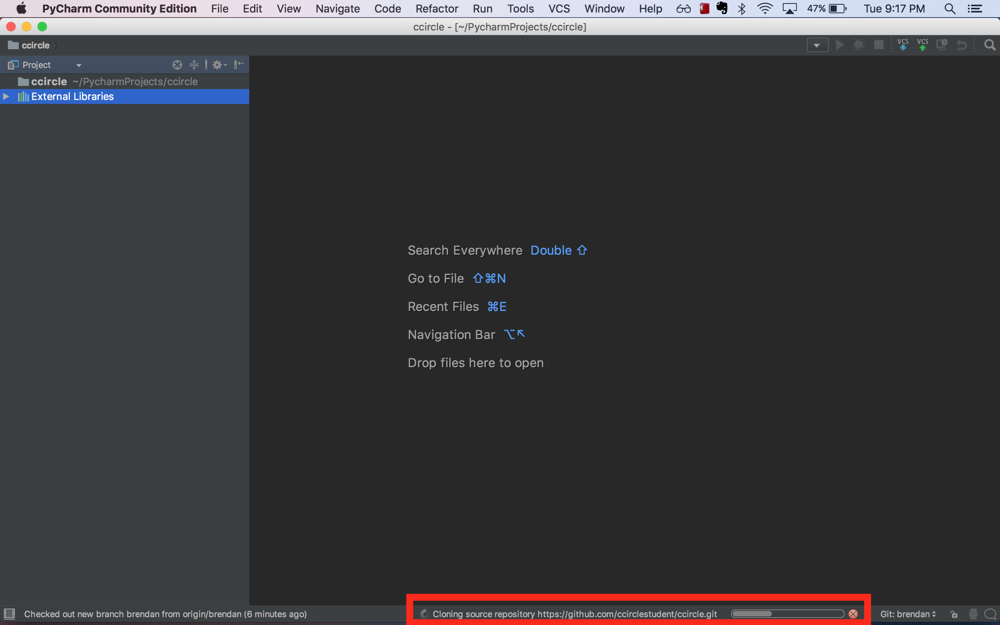
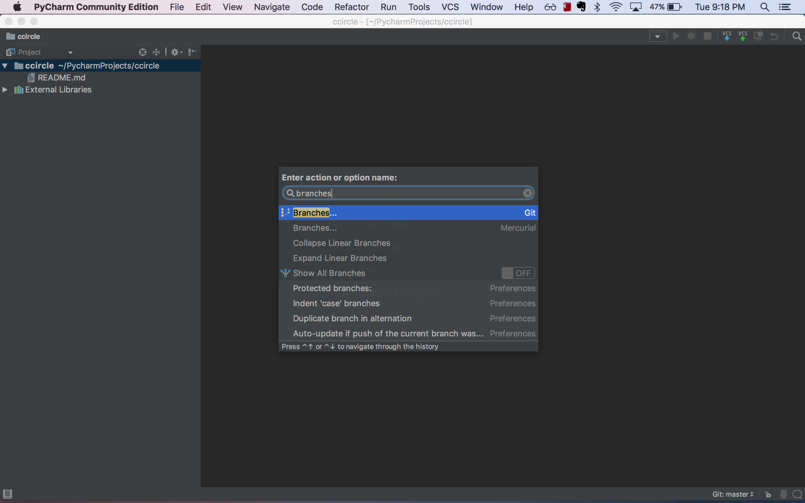
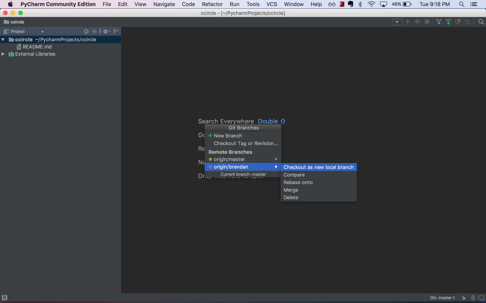
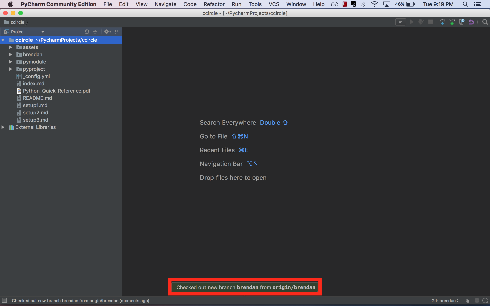

# CCircle.Git.Resources : Pulling Saved Code From GitHub On a Different Computer
> ##### Previous -> [CCircle.Docs.Index](../../../index.md)

* Open PyCharm and spotlight search (Ctrl+Shift+a) "checkout from version control"
    

* For the "Git Repository URL", put in "https://github.com/{your\_username}/ccircle.git".
    Ensure your connection to the remote url succeeds.
    

* You might get an error that the directory already exists, if so:
    open File Explorer, delete the ccircle directory, and click Clone.
    

* Wait for the clone to complete
    

* spotlight search (Ctrl+Shift+a) "branches"
    

* Under "Remote branches", select the one corresponding to your name, and "Checkout as new local branch".
    

* If that succeeds, you will see this message:
    

* At this point your current computer setup should be the exact same as how you left your other computer.
    All that's left to do is to get any changes to the ccircle repository that the staff have added since you've been gone.
    We can do that with a GitHub 'pull' as shown on [Pulling Staff Changes to ccircle](pull).

