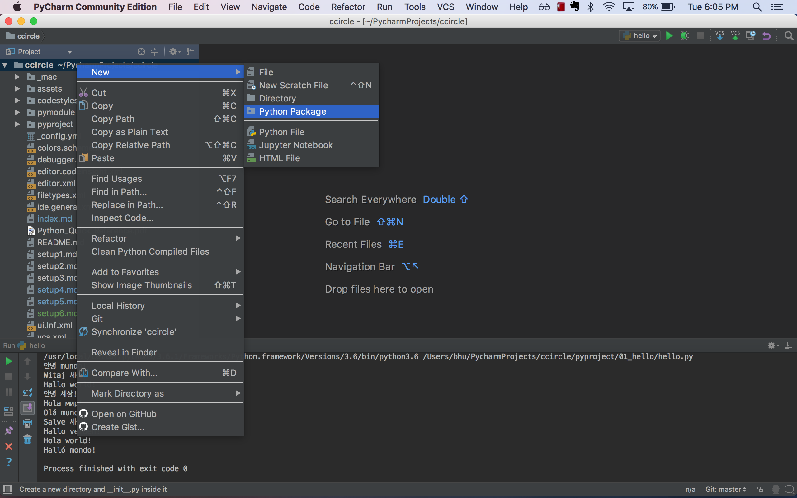
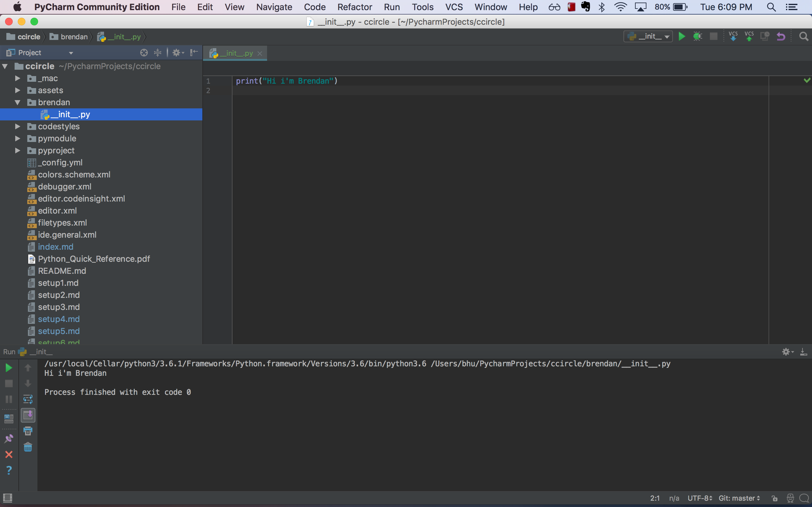
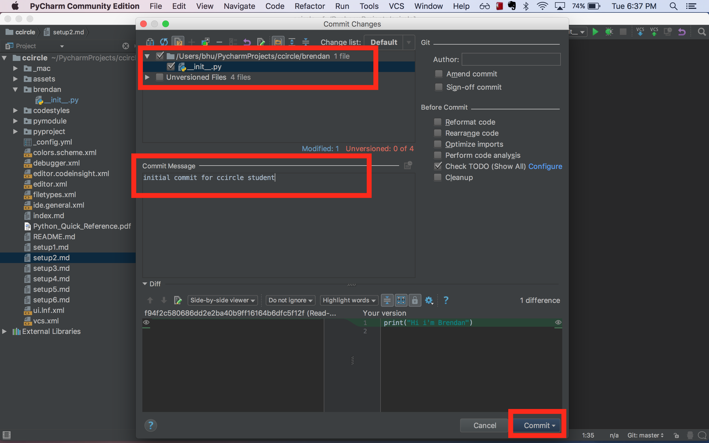
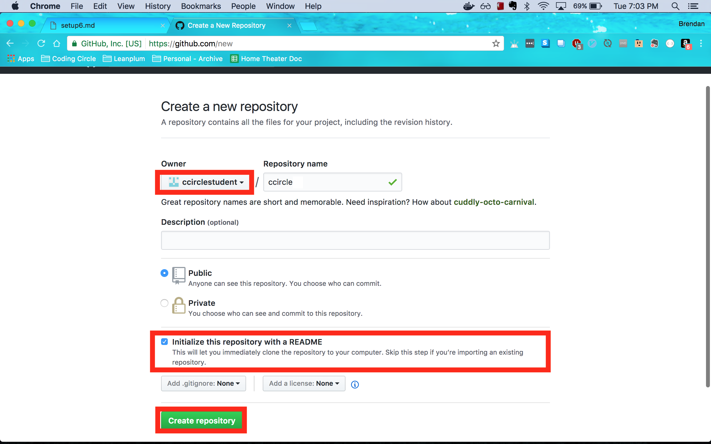
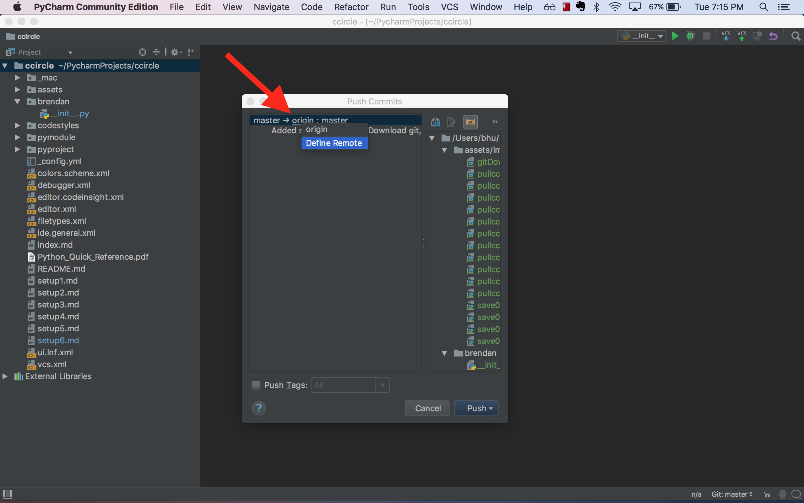

# CCircle.Git: Saving Code Online Using Git
> ##### Previous -> [CCircle.Docs.Index](../../../index.md)

* Open the ccircle project in PyCharm, right click "ccircle" in the Project pane, and select "New" -> "Python Package".
  Use your first name as the package's name:
    

* Navigate to the new directory with your name and open "\_\_init\_\_.py".
    Type some Python and "Run" it.
    

* Nice, now let's save your new code online so we don't lose it.
    To do this, we'll need to do two things:
        (1) Make a commit, a snapshot in time of our code, and
        (2) Push to our personal repository.

* Make a Git commit by spotlight searching (Ctrl-Shift-A) PyCharm for "commit changes".
    Make sure you check the box beside your "\_\_init\_\_.py" file -- this is telling Git that you want to save this file online.
    In the "commit message" box, type any commit message you'd like. Perhaps something along the lines of "initial commit".
    Click the "Commit" button in the bottom-right.
    

* Before we push to our personal repository, we'll need to create one!
    Navigate to the [Create new repository GitHub page](www.github.com/new) and verify that your username is the one listed under the "Owner".
    Name the repository "ccircle", click the box to "Initialize this repository with a README", then click "Create repository".
   

* Go back to PyCharm so we can configure it to push to our new personal repository.
    Spotlight search (Ctrl-Shift-A) PyCharm for "push".
    Click the word <u>origin</u>, then click "Define remote".
    For "Name" put "{your\_username}s-repo" and for "URL:" put "https://github.com/{your\_username}/ccircle.git".
    Click "OK" then "Push".
    

* To confirm our push worked, we can look at the python code we just typed online!
    Navigate to https://github.com/{your_github_username}/ccircle
    and click on the "branch" button; select your name, in my case it is the branch "brendan".
    
    Find the folder with your first name and verify the contents of the "\_\_init\_\_.py" file within.
    
